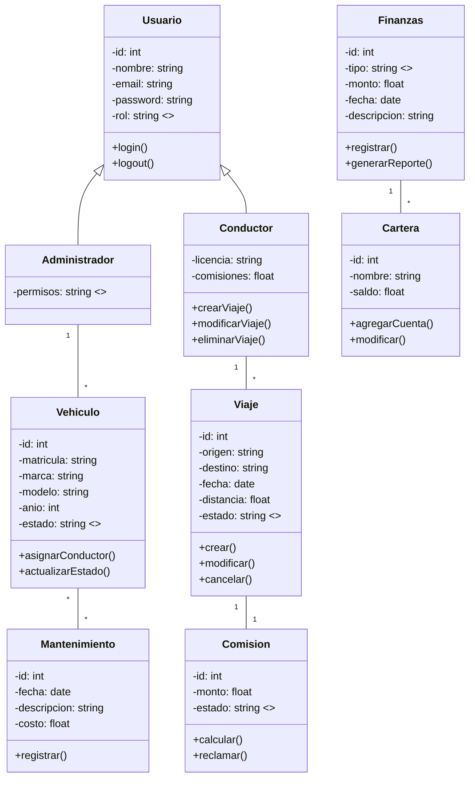

```mermaid
classDiagram
class Usuario {
  -id: int
  -nombre: string
  -email: string
  -password: string
  -rol: string  <<ADMIN | CONDUCTOR>>
  +login()
  +logout()
}

class Administrador {
  -permisos: string  <<lista>>
}

class Conductor {
  -licencia: string
  -comisiones: float
  +crearViaje()
  +modificarViaje()
  +eliminarViaje()
}

class Vehiculo {
  -id: int
  -matricula: string
  -marca: string
  -modelo: string
  -anio: int
  -estado: string <<Activo | Inactivo>>
  +asignarConductor()
  +actualizarEstado()
}

class Mantenimiento {
  -id: int
  -fecha: date
  -descripcion: string
  -costo: float
  +registrar()
}

class Viaje {
  -id: int
  -origen: string
  -destino: string
  -fecha: date
  -distancia: float
  -estado: string <<Pendiente | Finalizado | Cancelado>>
  +crear()
  +modificar()
  +cancelar()
}

class Comision {
  -id: int
  -monto: float
  -estado: string <<Pendiente | Pagada | Reclamada>>
  +calcular()
  +reclamar()
}

class Finanzas {
  -id: int
  -tipo: string <<Ingreso | Egreso>>
  -monto: float
  -fecha: date
  -descripcion: string
  +registrar()
  +generarReporte()
}

class Cartera {
  -id: int
  -nombre: string
  -saldo: float
  +agregarCuenta()
  +modificar()
}

Usuario <|-- Administrador
Usuario <|-- Conductor
Conductor "1" -- "*" Viaje
Viaje "1" -- "1" Comision
Administrador "1" -- "*" Vehiculo
Vehiculo "*" -- "*" Mantenimiento
Finanzas "1" -- "*" Cartera
```