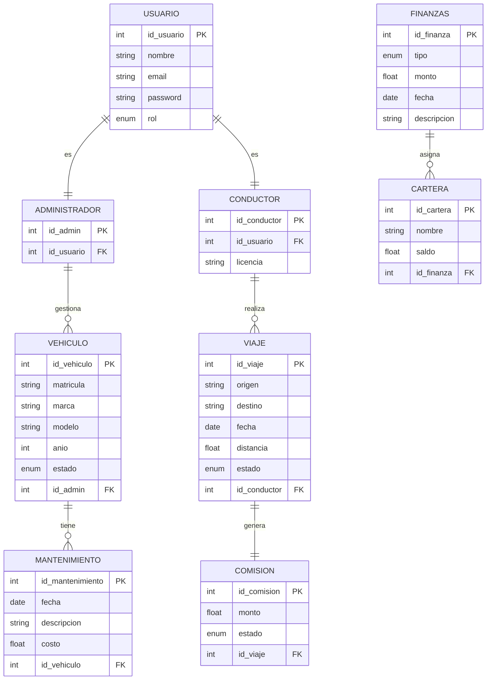

```mermaid
erDiagram
USUARIO {
    int id_usuario PK
    string nombre
    string email
    string password
    enum rol
}
ADMINISTRADOR {
    int id_admin PK
    int id_usuario FK
}
CONDUCTOR {
    int id_conductor PK
    int id_usuario FK
    string licencia
}
VEHICULO {
    int id_vehiculo PK
    string matricula
    string marca
    string modelo
    int anio
    enum estado
    int id_admin FK
}
MANTENIMIENTO {
    int id_mantenimiento PK
    date fecha
    string descripcion
    float costo
    int id_vehiculo FK
}
VIAJE {
    int id_viaje PK
    string origen
    string destino
    date fecha
    float distancia
    enum estado
    int id_conductor FK
}
COMISION {
    int id_comision PK
    float monto
    enum estado
    int id_viaje FK
}
FINANZAS {
    int id_finanza PK
    enum tipo
    float monto
    date fecha
    string descripcion
}
CARTERA {
    int id_cartera PK
    string nombre
    float saldo
    int id_finanza FK
}
USUARIO ||--|| ADMINISTRADOR : "es"
USUARIO ||--|| CONDUCTOR : "es"
ADMINISTRADOR ||--o{ VEHICULO : "gestiona"
VEHICULO ||--o{ MANTENIMIENTO : "tiene"
CONDUCTOR ||--o{ VIAJE : "realiza"
VIAJE ||--|| COMISION : "genera"
FINANZAS ||--o{ CARTERA : "asigna"
```