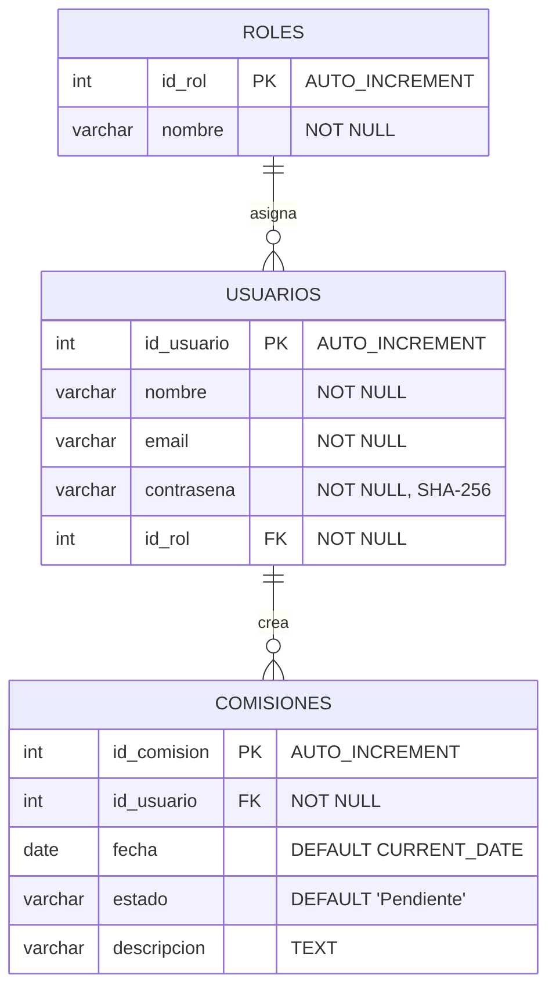
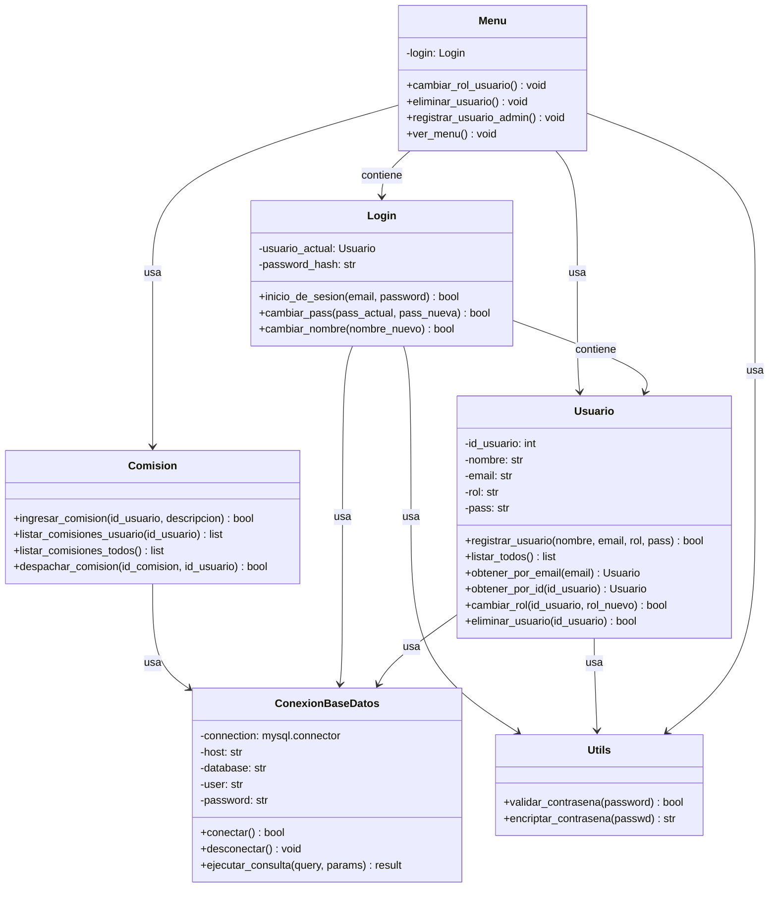

# Diseño y Documentación de la Base de Datos

## Entidades Principales

- **Usuario**: representa a los individuos que interactúan con el sistema.
- **Rol**: determina los permisos y el nivel de acceso del usuario.
- **Comision**: solicitud generada por un usuario.

## Atributos de Cada Entidad

### *Usuarios*

- `id_usuario`: Identificador único (INT, AUTO_INCREMENT, PK).
- `nombre`: Nombre completo del usuario (VARCHAR(100), NOT NULL).
- `email`: Dirección de correo (VARCHAR(100), NOT NULL).
- `contrasena`: Hash de la contraseña SHA-256 (VARCHAR(64), NOT NULL).
- `id_rol`: Referencia al rol asignado (INT, FK, NOT NULL).

### *Roles*

- `id_rol`: Clave primaria (INT, AUTO_INCREMENT, PK).
- `nombre`: Nombre del rol (VARCHAR(50), NOT NULL).

### *Comisiones*

- `id_comision`: Identificador de la comisión (INT, AUTO_INCREMENT, PK).
- `id_usuario`: Usuario que realiza la comisión (INT, FK, NOT NULL).
- `fecha`: Fecha de creación (DATE, DEFAULT CURRENT_DATE).
- `estado`: Estado actual (VARCHAR(20), DEFAULT 'Pendiente').
- `descripcion`: Detalles de la comisión (VARCHAR(500)).

## Relaciones Entre Entidades

- **Usuario ↔ Rol**  
  Relación de **uno a muchos**.  
  Cada *Rol* puede estar asociado a varios *Usuarios*, pero cada *Usuario* tiene asignado solo un *Rol*.  
  _(Representación: `Usuarios }o--|| Roles`)_

- **Usuario ↔ Comisión**  
  Relación de **uno a muchos**.  
  Un *Usuario* puede registrar múltiples *Comisiones*, pero cada *Comisión* pertenece a un único *Usuario*.  
  _(Representación: `Usuarios ||--o{ Comisiones`)_

## Normalización

El modelo fue normalizado hasta **Tercera Forma Normal (3FN)** para evitar redundancias y dependencias innecesarias:

- Todos los atributos son atómicos (1FN).
- Se eliminaron dependencias parciales (2FN).
- Se eliminaron dependencias transitivas, separando responsabilidades conceptuales en distintas tablas (3FN).

## Modelo Relacional



## Diagrama de Clases



## Consideraciones de Diseño

- **Base de datos**: `logisticom_db` - nombre específico del proyecto
- **Roles en tabla separada**: mejora la escalabilidad y evita errores de tipeo o inconsistencias.
- **Contraseñas hasheadas**: se aplica SHA-256 antes del almacenamiento.

## Features

1. **Autenticación**: Los usuarios se autentican con email y contraseña encriptada.
2. **Autorización**: Los roles determinan qué operaciones puede realizar cada usuario.
3. **Auditoría**: Todas las comisiones registran fecha de creación automáticamente.
4. **Estados**: Las comisiones tienen un ciclo de vida (Pendiente → Despachado).
5. **Integridad**: Se mantiene consistencia de datos a nivel de aplicación.

## Datos de Prueba

```sql
-- Roles iniciales
INSERT INTO roles (nombre) VALUES ('admin'), ('usuario');

-- Usuarios de prueba
INSERT INTO usuarios (nombre, email, contrasena, id_rol) 
VALUES 
  ('Admin', 'admin@abc.com', SHA2('admin123', 256), 1),
  ('Juan', 'juan@abc.com', SHA2('user123', 256), 2);
```

## Estructura de Archivos

- `proyecto_base_de_datos.sql`: Script de creación de la base de datos
- `CRUD.sql`: Ejemplos de operaciones CRUD
- `diagrams/diagrama-entidad-relacion.md`: Diagrama E-R en Mermaid
- `diagrams/diagrama-clases.md`: Diagrama de clases en Mermaid
