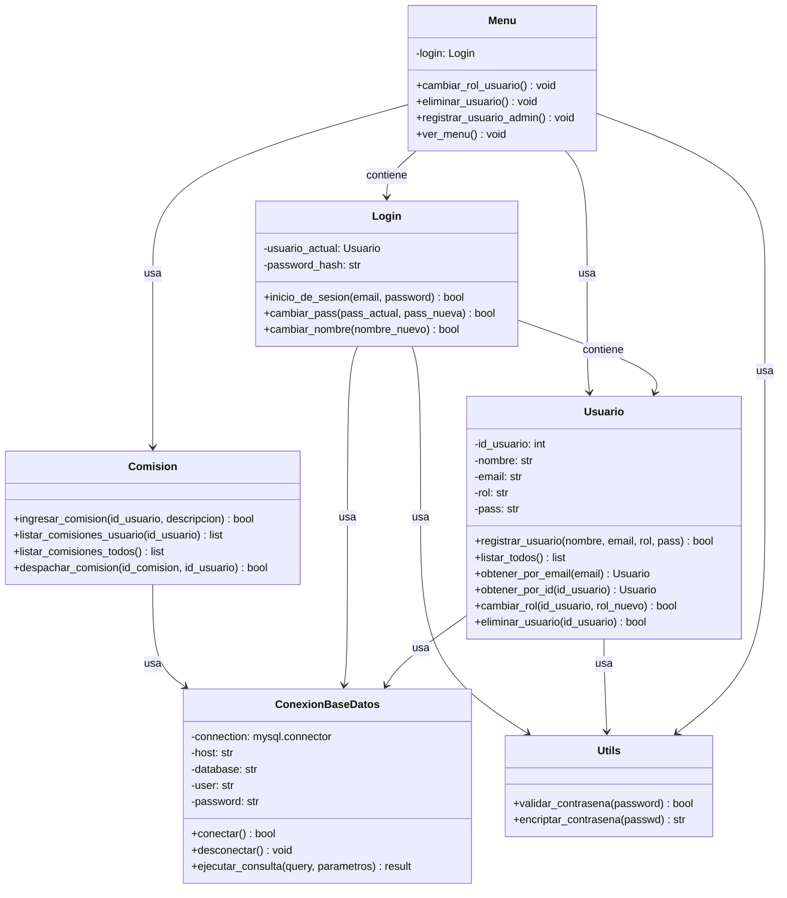

# Diagrama de Clases - Logisticom (Sistema de Comisiones)

```mermaid
classDiagram
    class ConexionBaseDatos {
        -connection: mysql.connector
        -host: str
        -database: str
        -user: str
        -password: str
        +conectar() bool
        +desconectar() void
        +ejecutar_consulta(query, parametros) result
    }

    class Usuario {
        -id_usuario: int
        -nombre: str
        -email: str
        -rol: str
        -pass: str
        +registrar_usuario(nombre, email, rol, pass) bool
        +listar_todos() list
        +obtener_por_email(email) Usuario
        +obtener_por_id(id_usuario) Usuario
        +cambiar_rol(id_usuario, rol_nuevo) bool
        +eliminar_usuario(id_usuario) bool
    }

    class Login {
        -usuario_actual: Usuario
        -password_hash: str
        +inicio_de_sesion(email, password) bool
        +cambiar_pass(pass_actual, pass_nueva) bool
        +cambiar_nombre(nombre_nuevo) bool
    }

    class Comision {
        +ingresar_comision(id_usuario, descripcion) bool
        +listar_comisiones_usuario(id_usuario) list
        +listar_comisiones_todos() list
        +despachar_comision(id_comision, id_usuario) bool
    }

    class Menu {
        -login: Login
        +cambiar_rol_usuario() void
        +eliminar_usuario() void
        +registrar_usuario_admin() void
        +ver_menu() void
    }

    class Utils {
        +validar_contrasena(password) bool
        +encriptar_contrasena(passwd) str
    }

    %% Relaciones
    Usuario --> ConexionBaseDatos : usa
    Login --> Usuario : contiene
    Login --> ConexionBaseDatos : usa
    Comision --> ConexionBaseDatos : usa
    Menu --> Usuario : usa
    Menu --> Login : contiene
    Menu --> Comision : usa
    Menu --> Utils : usa
    Usuario --> Utils : usa
    Login --> Utils : usa
```
