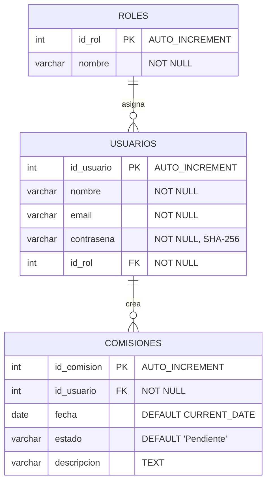

# Modelo Entidad-Relación - Logisticom (Sistema de Comisiones)



## Descripción Detallada del Modelo

### Entidad: ROLES
**Propósito**: Define los tipos de usuarios del sistema

| Atributo | Tipo | Restricciones | Descripción |
|----------|------|---------------|-------------|
| id_rol | INT | PK, AUTO_INCREMENT | Identificador único del rol |
| nombre | VARCHAR(50) | NOT NULL | Nombre del rol (admin, usuario) |

**Valores posibles:**
- admin: Administrador del sistema
- usuario: Usuario estándar

### Entidad: USUARIOS
**Propósito**: Almacena información de los usuarios del sistema

| Atributo | Tipo | Restricciones | Descripción |
|----------|------|---------------|-------------|
| id_usuario | INT | PK, AUTO_INCREMENT | Identificador único del usuario |
| nombre | VARCHAR(100) | NOT NULL | Nombre completo del usuario |
| email | VARCHAR(100) | NOT NULL | Email del usuario |
| contrasena | VARCHAR(64) | NOT NULL | Contraseña encriptada con SHA-256 |
| id_rol | INT | FK, NOT NULL | Referencia al rol del usuario |

### Entidad: COMISIONES
**Propósito**: Registra las comisiones creadas por los usuarios

| Atributo | Tipo | Restricciones | Descripción |
|----------|------|---------------|-------------|
| id_comision | INT | PK, AUTO_INCREMENT | Identificador único de la comisión |
| id_usuario | INT | FK, NOT NULL | Referencia al usuario que creó la comisión |
| fecha | DATE | DEFAULT CURRENT_DATE | Fecha de creación de la comisión |
| estado | VARCHAR(20) | DEFAULT 'Pendiente' | Estado actual de la comisión |
| descripcion | VARCHAR(500) | NULL | Descripción detallada de la comisión |

**Estados posibles:**
- Pendiente: Comisión creada, esperando procesamiento
- Despachado: Comisión procesada y completada

## Relaciones del Modelo

### 1. ROLES → USUARIOS (1:N)
- **Tipo**: Uno a Muchos
- **Descripción**: Un rol puede ser asignado a muchos usuarios
- **Cardinalidad**: 1 rol → N usuarios
- **Restricción**: Un usuario debe tener exactamente un rol

### 2. USUARIOS → COMISIONES (1:N)
- **Tipo**: Uno a Muchos
- **Descripción**: Un usuario puede crear muchas comisiones
- **Cardinalidad**: 1 usuario → N comisiones
- **Restricción**: Una comisión debe ser creada por exactamente un usuario

## Reglas de Negocio

1. **Autenticación**: Los usuarios se autentican con email y contraseña
2. **Autorización**: Los roles determinan qué operaciones puede realizar cada usuario
3. **Auditoría**: Todas las comisiones registran fecha de creación
4. **Estados**: Las comisiones tienen un ciclo de vida (Pendiente → Despachado)
5. **Integridad**: No se pueden eliminar usuarios que tengan comisiones asociadas

## Datos de Prueba

```sql
-- Roles iniciales
INSERT INTO roles (nombre) VALUES ('admin'), ('usuario');

-- Usuarios de prueba
INSERT INTO usuarios (nombre, email, contrasena, id_rol) 
VALUES 
  ('Admin', 'admin@abc.com', SHA2('admin123', 256), 1),
  ('Juan', 'juan@abc.com', SHA2('user123', 256), 2);
```
